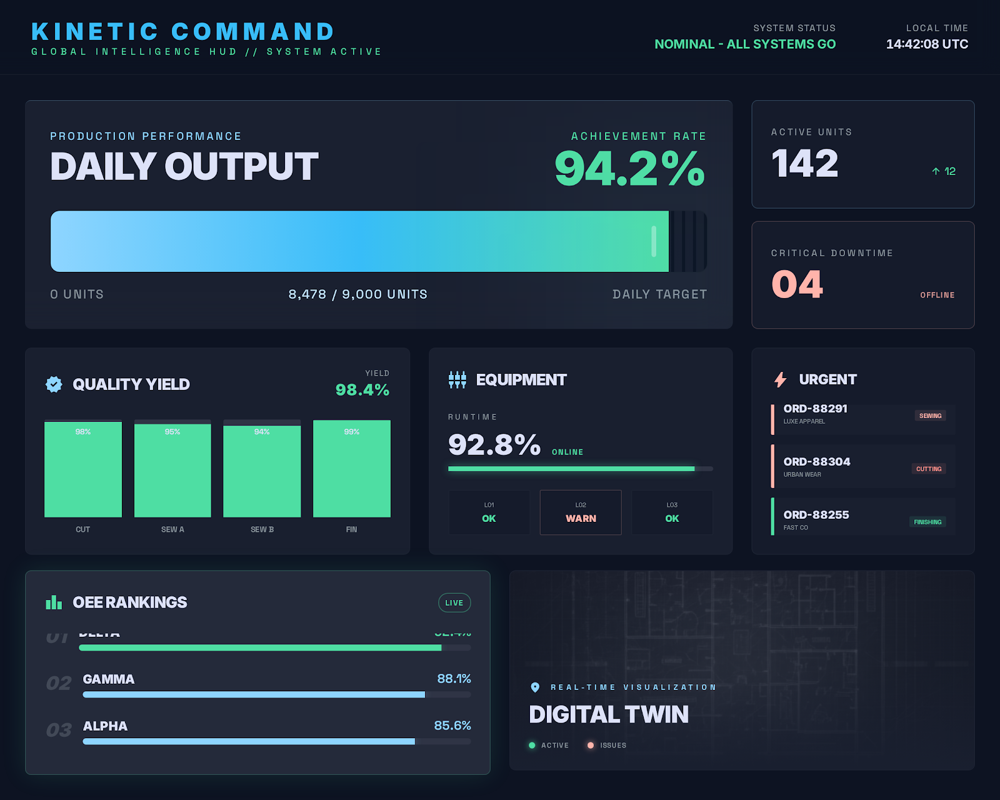
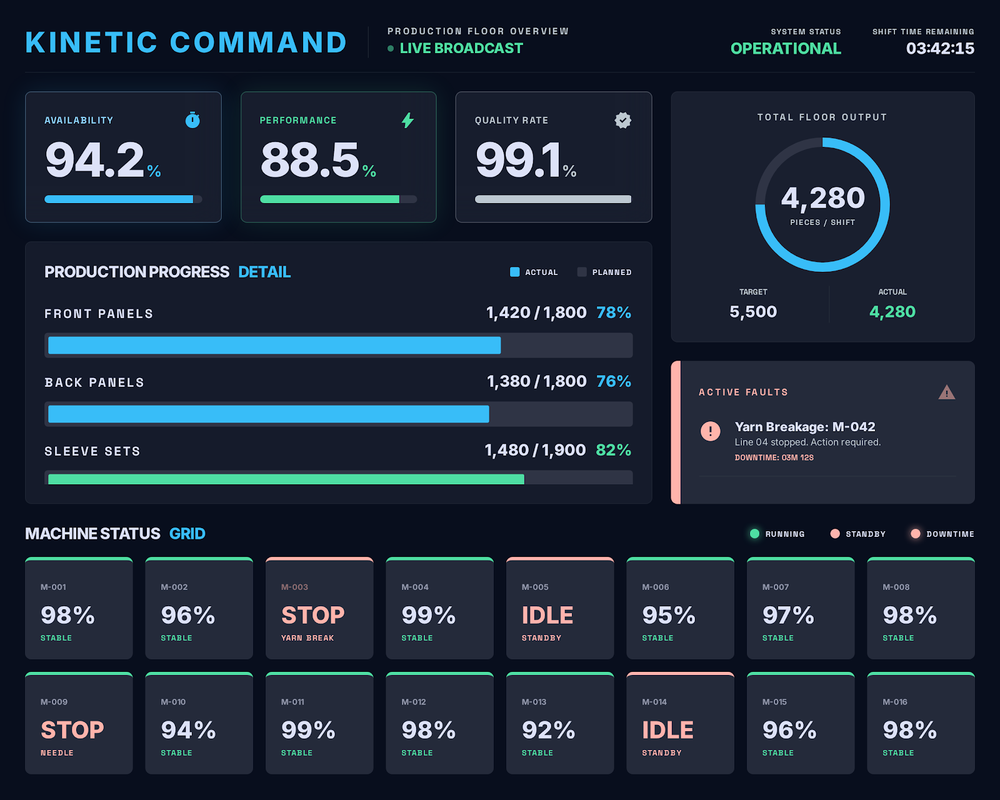
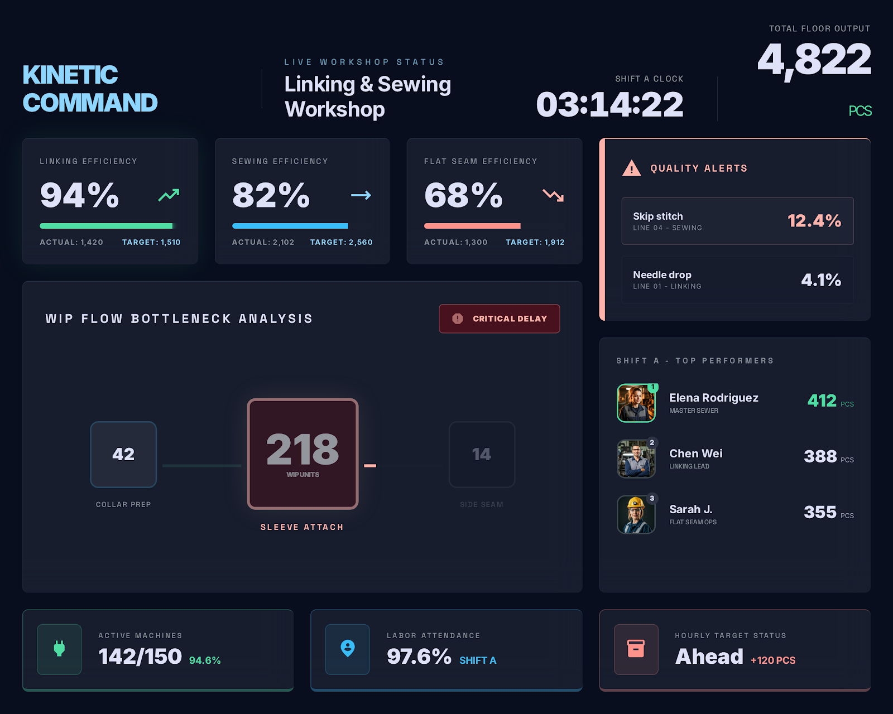
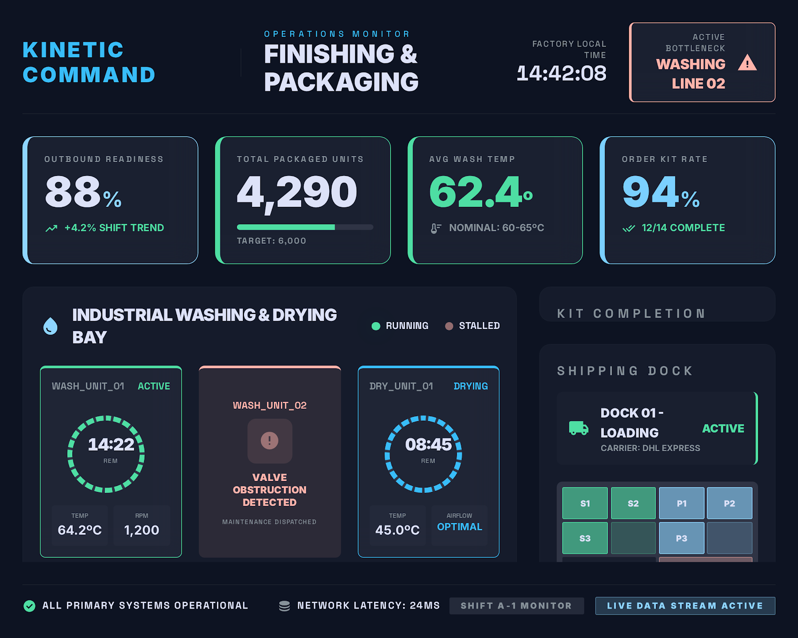

# MES Dashboard Showcase

[English Version](./README_EN.md)

一个面向制造业场景的 MES 数据大屏作品集项目，重点展示我在 `工业可视化`、`实时数据模拟`、`大屏适配`、`React 前端工程化` 方面的综合交付能力。

这个项目不是普通的静态 UI 练习，而是一套可用于向客户演示的生产管理大屏原型，覆盖工厂总览、编织车间、套口与缝合车间、后整包装车间 4 个核心业务场景。

## 项目亮点

- 面向真实业务：围绕制造工厂 MES 场景设计，不是泛用后台模板
- 四块业务大屏：对应不同管理角色与生产环节
- 动态模拟数据：已接入本地 Mock Realtime 数据流，不再只是静态页面
- 高拟真联动：设备故障、产量变化、WIP 瓶颈、订单齐套率会相互影响
- 大屏适配：支持 `1920x1080` 设计稿等比缩放，适合电视、展厅屏、车间看板
- 前端结构清晰：具备类型、状态、模拟引擎、实时适配层，可平滑切换真实接口

## 项目定位

- 制造业数据大屏 / BI 可视化前端样例
- 工厂生产监控看板原型
- MES / ERP / IoT 数据可视化展示项目
- 适合用于演示、PoC、MVP 或正式项目的前端基础版本
- 可平滑扩展为真实 API / WebSocket 驱动的实时驾驶舱

## 页面预览

### 1. 工厂总览大屏

聚焦管理层视角，展示全厂达成率、设备运行率、质量良率、急单追踪与车间排行。



### 2. 编织车间大屏

聚焦设备密集型车间，展示 OEE、生产进度、故障告警与机台状态矩阵。



### 3. 套口与缝合车间大屏

聚焦人工工序与 WIP 流转，展示工序瓶颈、质量预警、班组效率与人员排行。



### 4. 后整与包装车间大屏

聚焦洗水、烘干、包装与出货衔接，展示设备状态、批次进度、订单齐套率与发货状态。



## 已实现能力

### 动态数据模拟

- 使用本地 Mock Realtime 数据流模拟真实生产现场
- 所有大屏共用统一“工厂世界状态”
- 每秒推进数据时钟与业务状态
- 支持连接中、在线、重连中、离线最近快照等状态表现

### 业务联动规则

- 编织机台停机会拉低 OEE 和总览达成率
- 上游产出变化会影响套口与缝合 WIP 堆积
- 质量缺陷变化会影响班组效率与预警状态
- 后整设备预警会影响批次 ETA、订单齐套率与发货状态

### 工程结构

- `types/`：统一领域模型与实时协议
- `mock/engine/`：世界状态、规则引擎、tick 推进
- `services/realtime/`：Mock / Live 实时客户端抽象
- `store/`：Zustand 全局状态管理
- `hooks/`：连接状态与全局订阅编排
- `pages/`：4 个业务大屏页面
- `components/ScreenAdapter.tsx`：大屏缩放适配容器

## 技术栈

```text
React 19
TypeScript
Vite
Tailwind CSS v4
Zustand
ECharts
Mock Realtime Engine
Responsive TV Screen Adapter
```

## 技术价值

### 1. 不只是静态界面

这个项目体现的是完整的前端解决方案能力：

- 能理解制造业场景与业务指标
- 能把复杂信息压缩成适合大屏观看的可视化布局
- 能搭建可替换真实接口的实时数据架构
- 能处理大屏长期运行中的稳定性与适配问题

### 2. 具备继续工程化的基础

当前项目已经具备以下基础：

- 可演示的 UI
- 可演示的动态数据
- 可扩展的数据模型
- 可替换的实时通信接口
- 面向生产系统的页面拆分方式

后续只需要补真实数据源与服务端能力，即可继续向正式项目推进。

## 本地运行

### 1. 安装依赖

```bash
cd frontend
npm install
```

### 2. 启动开发环境

```bash
npm run dev
```

### 3. 生产构建

```bash
npm run build
```

### 4. 代码检查

```bash
npm run lint
```

## 项目结构

```text
mes-dashboard/
├─ docs/
├─ frontend/
│  ├─ src/
│  │  ├─ components/
│  │  ├─ config/
│  │  ├─ hooks/
│  │  ├─ mock/
│  │  ├─ pages/
│  │  ├─ services/
│  │  ├─ store/
│  │  ├─ types/
│  │  └─ utils/
├─ public/
│  ├─ factory_overview_tv_display_auto_scroll/
│  ├─ knitting_workshop_tv_display_auto_scroll/
│  ├─ linking_sewing_tv_display_auto_scroll/
│  └─ finishing_packaging_tv_display_auto_scroll/
```

## 后续演进

- 将当前演示版继续完善为可上线项目
- 对接真实 MES / ERP / IoT 数据源
- 增加服务端数据聚合、缓存与告警能力
- 增加角色权限、多屏路由控制与部署方案
- 增加图表钻取、历史趋势、报警中心等能力
- 引入国际化、权限、主题系统等企业级能力
- 进一步优化大屏展示、电视适配、性能与长时运行稳定性
